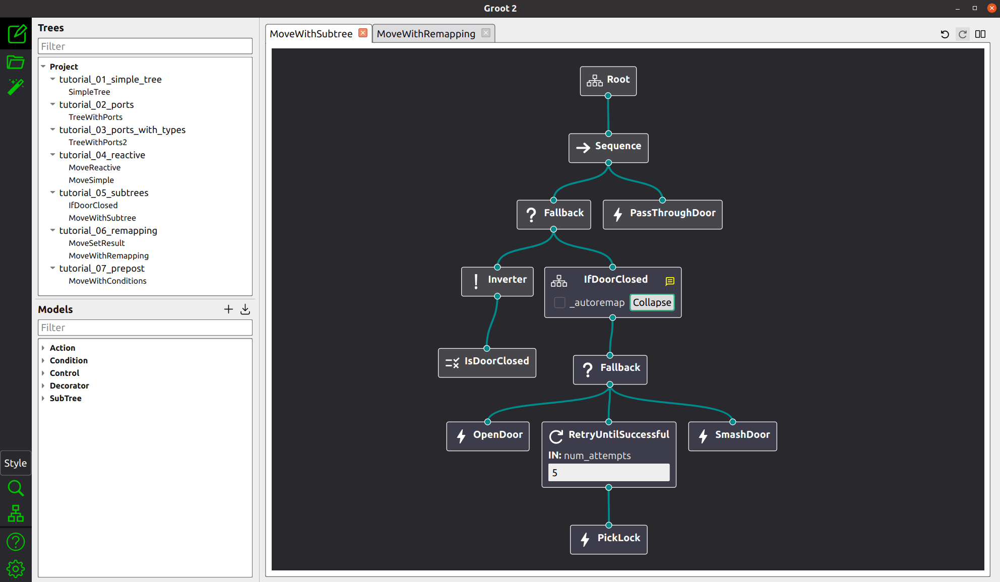

[](https://github.com/BehaviorTree/BehaviorTree.CPP/actions/workflows/cmake_ubuntu.yml)
[](https://github.com/BehaviorTree/BehaviorTree.CPP/actions/workflows/cmake_windows.yml)
[](https://github.com/BehaviorTree/BehaviorTree.CPP/actions/workflows/ros2.yaml)
[](https://github.com/BehaviorTree/BehaviorTree.CPP/actions/workflows/pixi.yaml)

# BehaviorTree.CPP 4.7

<p align="center"></p>

This  __C++ 17__ library provides a framework to create BehaviorTrees.
It was designed to be flexible, easy to use, reactive and fast.

Even if our main use-case is __robotics__, you can use this library to build
__AI for games__, or to replace Finite State Machines.

There are few features which make __BehaviorTree.CPP__ unique, when compared to other implementations:

- It makes __asynchronous Actions__, i.e. non-blocking, a first-class citizen.

- You can build __reactive__ behaviors that execute multiple Actions concurrently (orthogonality).

- Trees are defined using a Domain Specific __scripting language__ (based on XML), and can be loaded at run-time; in other words, even if written in C++, the morphology of the Trees is _not_ hard-coded.

- You can statically link your custom TreeNodes or convert them into __plugins__
and load them at run-time.

- It provides a type-safe and flexible mechanism to do __Dataflow__ between
  Nodes of the Tree.

- It includes a __logging/profiling__ infrastructure that allows the user
to visualize, record, replay and analyze state transitions.

## Documentation and Community

You can learn about the main concepts, the API and the tutorials here: https://www.behaviortree.dev/

An automatically generated API documentation can be found here: https://BehaviorTree.github.io/BehaviorTree.CPP/

If the documentation doesn't answer your questions and/or you want to
connect with the other **BT.CPP** users, visit [our forum](https://github.com/BehaviorTree/BehaviorTree.CPP/discussions)

# GUI Editor

Editing a BehaviorTree is as simple as editing an XML file in your favorite text editor.

If you are looking for a more fancy graphical user interface (and I know you do) check
[Groot2](https://www.behaviortree.dev/groot) out.



# How to compile

**BT.CPP** requires a compile that supports c++17.

Three build systems are supported:

- **colcon (ament)**, if you use ROS2
- **conan** otherwise (Linux/Windows).
- **straight cmake** if you want to be personally responsible for dependencies :)

Compiling with [conan](https://conan.io/):

Assuming that you are in the **parent** directory of `BehaviorTree.CPP`:

```
mkdir build_release
conan install . -of build_release -s build_type=Release
cmake -S . -B build_release -DCMAKE_TOOLCHAIN_FILE="build_release/conan_toolchain.cmake"
cmake --build build_release --parallel
```

If you have dependencies such as ZeroMQ and SQlite already installed and you don't want to
use conan, simply type:

```
mkdir build_release
cmake -S . -B build_release
cmake --build build_release --parallel
```

If you want to build in a [pixi](https://pixi.sh/) project (conda virtual environment).
```
pixi run build
```

If you want to use BT.CPP in your application, please refer to the
example here: https://github.com/BehaviorTree/btcpp_sample .

# Commercial support

Are you using BT.CPP in your commercial product and do you need technical support / consulting?
You can contact the primary author, **dfaconti@aurynrobotics.com**, to discuss your use case and needs.

# Star History

[](https://star-history.com/#BehaviorTree/BehaviorTree.CPP&Date)

## Previous version

Version 3.8 of the software can be found in the branch
[v3.8](https://github.com/BehaviorTree/BehaviorTree.CPP/tree/v3.8).

That branch might receive bug fixes, but the new features will be implemented
only in the master branch.

# License

The MIT License (MIT)

Copyright (c) 2019-2023 Davide Faconti

Copyright (c) 2018-2019 Davide Faconti, Eurecat

Copyright (c) 2014-2018 Michele Colledanchise

Permission is hereby granted, free of charge, to any person obtaining a copy
of this software and associated documentation files (the "Software"), to deal
in the Software without restriction, including without limitation the rights
to use, copy, modify, merge, publish, distribute, sublicense, and/or sell
copies of the Software, and to permit persons to whom the Software is
furnished to do so, subject to the following conditions:

The above copyright notice and this permission notice shall be included in all
copies or substantial portions of the Software.

THE SOFTWARE IS PROVIDED "AS IS", WITHOUT WARRANTY OF ANY KIND, EXPRESS OR
IMPLIED, INCLUDING BUT NOT LIMITED TO THE WARRANTIES OF MERCHANTABILITY,
FITNESS FOR A PARTICULAR PURPOSE AND NONINFRINGEMENT. IN NO EVENT SHALL THE
AUTHORS OR COPYRIGHT HOLDERS BE LIABLE FOR ANY CLAIM, DAMAGES OR OTHER
LIABILITY, WHETHER IN AN ACTION OF CONTRACT, TORT OR OTHERWISE, ARISING FROM,
OUT OF OR IN CONNECTION WITH THE SOFTWARE OR THE USE OR OTHER DEALINGS IN THE
SOFTWARE.
