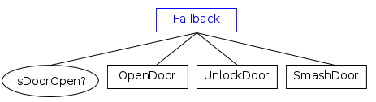
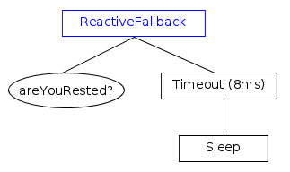

# Fallback

This family of nodes are known as "Selector" or "Priority"
in other frameworks.

Their purpose is to try different strategies, until we find one that "works".

They share the following rules:

- Before ticking the first child, the node status becomes __RUNNING__.

- If a child returns __FAILURE__, the fallback ticks the next child.

- If the __last__ child returns __FAILURE__ too, all the children are halted and
 the sequence returns __FAILURE__.
 
- If a child returns __SUCCESS__, it stops and returns __SUCCESS__.
  All the children are halted. 

The two versions of Fallback differ in the way they react when a child returns
RUNNING:

- FallbackStar will return RUNNING and the next time it is ticked,
 it will tick the same child where it left off before.
 
- Plain old Fallback will return RUNNING and the index of the next child to
 execute is reset after each execution.

## Fallback

In this example, we try different strategies to open the door. 
Check first (and once) if the door is open.



??? example "See the pseudocode"
	``` c++
		// index is initialized to 0 in the constructor
		status = RUNNING;

		while( _index < number_of_children )
		{
			child_status = child[index]->tick();
			
			if( child_status == RUNNING ) {
				// Suspend execution and return RUNNING.
				// At the next tick, _index will be the same.
				return RUNNING;
			}
			else if( child_status == FAILURE ) {
				// continue the while loop
				_index++;
			}
			else if( child_status == SUCCESS ) {
				// Suspend execution and return SUCCESS.
   			    HaltAllChildren();
				_index = 0;
				return SUCCESS;
			}
		}
		// all the children returned FAILURE. Return FAILURE too.
		index = 0;
		HaltAllChildren();
		return FAILURE;
	```	

## ReactiveFallback

This ControlNode is used when you want to interrupt an __asynchronous__
child if one of the previous Conditions changes its state from 
FAILURE to SUCCESS.

In the following example, character will sleep up to 8 hours or less,
if he/she is fully rested.




??? example "See the pseudocode"
	``` c++
		// index is initialized to 0 in the constructor
		status = RUNNING;

		while( index < number_of_children )
		{
			child_status = child[index]->tick();
			
			if( child_status == RUNNING ) {
				// Suspend execution and return RUNNING.
				// At the next tick, index will be the same.
				return RUNNING;
			}
			else if( child_status == FAILURE ) {
				// continue the while loop
				index++;
			}
			else if( child_status == SUCCESS ) {
				// Suspend execution and return SUCCESS.
				// At the next tick, index will be the same.
   			    HaltAllChildren();
				return SUCCESS;
			}
		}
		// all the children returned FAILURE. Return FAILURE too.
		index = 0;
		HaltAllChildren();
		return FAILURE;
	```	


 
