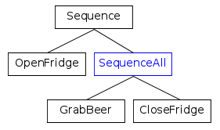

# Sequences

A __Sequence__ ticks all it's children, from left to right, as long as 
they return SUCCESS. If any child returns FAILURE, the sequence is suspended.

Here we introduce different kinds of TreeNodes:

- SequenceNode
- SequenceStarNode
- SequenceAllNode

The best way to determine which one should be used is to ask yourself:

    Q: "What should I do if one of the childs returns FAILURE?"

Use __SequenceNode__ if you answer is: 

    A: "Restart the entire sequence"

Use __SequenceStarNode__ if, instead, the answer is: 


    A: "Try again to execute the failed child.
        Do not re-tick children which succeeded already."
   
Last, use __SequenceAllNode__ when you want all the children to be ticked at least
once. If any of them failed, the SequenceAllNode returns FAILURE.   

The shared logic is:

- Before ticking the first child, SequenceNode becomes __RUNNING__.
- If a child returns __SUCCESS__, it ticks the next child.
- If the __last__ child returns __SUCCESS__ too, all the children are halted and
 the SequenceNode returns __SUCCESS__.
- If a child returns __RUNNING__, the sequence suspends and returns __RUNNING__. 
The next time it is ticked, it will tick the same child again.

The three Sequences differ in what they do if a child returns FAILURE.

## SequenceNode

If a child returns FAILURE, the sequence returns FAILURE.
Reset the index and halt all the children. 
The entire sequence will be executed again at the next tick.

__Example__:

This tree represents the behavior of a sniper in a computer game.
If any of these conditions/actions fails, the entire sequence is executed
again from the beginning.


??? example "See the pseudocode"
	``` c++
		// At the beginning, start from first child 
		if( state != RUNNING) {
			index = 0;
		}
		state = RUNNING;

		while( index < number_of_children )
		{
			child_state = child[index]->tick();
			
			if( child_state == RUNNING ) {
				// Suspend execution and return RUNNING.
				// At the next tick, index will be the same.
				state = RUNNING;
				return state;
			}
			else if( child_state == SUCCESS ) {
				// continue the while loop
				index++;
			}
			else if( child_state == FAILURE ) {
				// Suspend execution and return FAILURE.
				// index is reset and children are halted.
				state = FAILURE;
				index = 0;
				HaltAllChildren();
				return state;
			}
		}
		// all the children returned success. Return SUCCESS too.
		state = SUCCESS;
		HaltAllChildren();
		return state;
	```


## SequenceStarNode

If a child returns FAILURE, the sequence returns FAILURE. At the next tick, 
the failed child is executed again.

__Example__:

This is a patrolling agent/robot that must visit locations A, B and C only once.
If the action __GoTo(B)__ fails, __GoTo(A)__ will not be ticked again.

On the other hand, __isBatteryOK__ is visited at every tick, because its parent is a normal SequenceNode.


??? example "See the pseudocode"
	``` c++

		// index is initialized to 0 in the constructor
		state = RUNNING;

		while( index < number_of_children )
		{
			child_state = child[index]->tick();
			
			if( child_state == RUNNING ) {
				// Suspend execution and return RUNNING.
				// At the next tick, index will be the same.
				state = RUNNING;
				return state;
			}
			else if( child_state == SUCCESS ) {
				// continue the while loop
				index++;
			}
			else if( child_state == FAILURE ) {
				// Suspend execution and return FAILURE.
				// At the next tick, index will be the same.
				state = FAILURE;
				return state;
			}
		}
		// all the children returned success. Return SUCCESS too.
		state = SUCCESS;
		HaltAllChildren();
		return state;
	```


## SequenceAllNode

All the children are executed at least once. 
If __any__ child returned FAILURE,
the sequence is __not__ interrupted but the sequence itself will return FAILURE. 

__Example__:

If the door of the fridge was succesfully opened, grab a beer.
__CloseFridge__ is always executed, even when _GrabBeer_ failed.




??? example "See the pseudocode"
	``` c++
		if( state != RUNNING) {
			index = 0;
			at_least_one_failure = false;
		}
		state = RUNNING;
		
		while( index < number_of_children )
		{
			child_state = child[index]->tick();
			
			if( child_state == RUNNING ) {
				// Suspend execution and return RUNNING.
				// At the next tick, index will be the same.
				state = RUNNING;
				return state;
			}
			else if( child_state == SUCCESS ) {
				index++;
			}
			else if( child_state == FAILURE ) {
				index++;
				at_least_one_failure = true;
			}
		}
		// If any child failed, the entire sequence fails.	
		state =  at_least_one_failure ? FAILURE : SUCCESS;
		HaltAllChildren();
		return state;
	```


 
