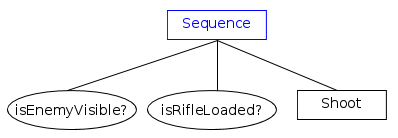
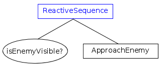
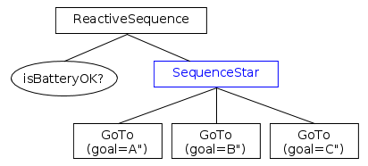

# Sequences

A __Sequence__ ticks all it's children as long as 
they return SUCCESS. If any child returns FAILURE, the sequence is aborted.

Currently the framework provides three kinds of nodes:

- Sequence
- SequenceStar
- ReactiveSequence

They share the following rules:

- Before ticking the first child, the node status becomes __RUNNING__.

- If a child returns __SUCCESS__, it ticks the next child.

- If the __last__ child returns __SUCCESS__ too, all the children are halted and
 the sequence returns __SUCCESS__.

To understand how the three ControlNodes differ, refer to the following table:

 
| Type of ControlNode | Child returns FAILURE  |  Child returns RUNNING |
|---|:---:|:---:|
| Sequence | Restart  | Tick again  |
| ReactiveSequence  | Restart  |  Restart |
| SequenceStar | Tick again  | Tick again  |

- "__Restart__" means that the entire sequence is restarted from the first 
  child of the list.

- "__Tick again__" means that the next time the sequence is ticked, the 
  same child is ticked again. Previous sibling, which returned SUCCESS already,
  are not ticked again.

## Sequence

This tree represents the behavior of a sniper in a computer game.



??? example "See the pseudocode"
	``` c++
		status = RUNNING;
        // _index is a private member

		while( index < number_of_children)
		{
			child_status = child[index]->tick();
			
            if( child_status == SUCCESS ) {
                _index++;
			}
			else if( child_status == RUNNING ) {
                // keep same index
				return RUNNING;
			}
			else if( child_status == FAILURE ) {
				HaltAllChildren();
                _index = 0;
				return FAILURE;
			}
		}
		// all the children returned success. Return SUCCESS too.
		HaltAllChildren();
        _index = 0;
		return SUCCESS;
	```

## ReactiveSequence

This node is particularly useful to continuously check Conditions; but 
the user should also be careful when using asynchronous children, to be
sure that thy are not ticked more often that expected.

Let's take a look at another example:



`ApproachEnemy` is an __asynchronous__ action that returns RUNNING until
it is, eventually, completed.

The condition `isEnemyVisible` will be called many times and, 
if it becomes false (i,e, "FAILURE"), `ApproachEnemy` is halted. 

??? example "See the pseudocode"
	``` c++
		status = RUNNING;

		for (int index=0; index < number_of_children; index++)
		{
			child_status = child[index]->tick();
			
			if( child_status == RUNNING ) {
				return RUNNING;
			}
			else if( child_status == FAILURE ) {
				HaltAllChildren();
				return FAILURE;
			}
		}
		// all the children returned success. Return SUCCESS too.
		HaltAllChildren();
		return SUCCESS;
	```

## SequenceStar

Use this ControlNode when you don't want to tick children again that 
already returned SUCCESS.

__Example__:

This is a patrolling agent/robot that must visit locations A, B and C __only once__.
If the action __GoTo(B)__ fails, __GoTo(A)__ will not be ticked again.

On the other hand, __isBatteryOK__ must be checked at every tick, 
for this reason its parent must be a `ReactiveSequence`.



??? example "See the pseudocode"
	``` c++
		status = RUNNING;
        // _index is a private member

		while( index < number_of_children)
		{
			child_status = child[index]->tick();
			
            if( child_status == SUCCESS ) {
                _index++;
			}
			else if( child_status == RUNNING || 
                     child_status == FAILURE ) 
            {
				// keep same index
				return child_status;
			}
		}
		// all the children returned success. Return SUCCESS too.
		HaltAllChildren();
        _index = 0;
		return SUCCESS;
	```


 
