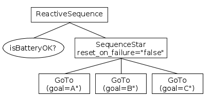

# Sequences

A __Sequence__ ticks all it's children as long as 
they return SUCCESS. If any child returns FAILURE, the sequence is aborted.

Currently the framework provides two kinds of nodes:

- SequenceNode
- SequenceStarNode


They share the following rules:

- Before ticking the first child, the node status becomes __RUNNING__.

- If a child returns __SUCCESS__, it ticks the next child.

- If the __last__ child returns __SUCCESS__ too, all the children are halted and
 the sequence returns __SUCCESS__.
 
 

## SequenceNode

- If a child returns FAILURE, the sequence returns FAILURE.
  The index is reset and all the children are halted. 

- If a child returns RUNNING:

     - the sequence returns RUNNING.
     - the loop is restarted and  all the previous children are ticked again __unless
       they are ActionNodes__. 
  
__Example__:

This tree represents the behavior of a sniper in a computer game.
If any of these conditions/actions fails, the entire sequence is executed
again from the beginning.

A running actions will be interrupted if __isEnemyVisible__ becomes
false (i.e. it returns FAILURE).


??? example "See the pseudocode"
	``` c++
		status = RUNNING;

		for (int index=0; index < number_of_children; index++)
		{
			child_status = child[index]->tick();
			
			if( child_status == RUNNING ) {
				// Suspend execution and return RUNNING.
				// At the next tick, index will be the same.
				return RUNNING;
			}
			else if( child_status == FAILURE ) {
				// Suspend execution and return FAILURE.
				// index is reset and children are halted.
				HaltAllChildren();
				return FAILURE;
			}
		}
		// all the children returned success. Return SUCCESS too.
		HaltAllChildren();
		return SUCCESS;
	```


## SequenceStarNode

Use this ControlNode when you don't want to tick a child more than once.

You can customize its behavior using the [NodeParameter](NodeParameters.md) "reset_on_failure".

- If a child returns FAILURE, the sequence returns FAILURE. 

     - [reset_on_failure = "true"]: (default) the loop is restarted.
     - [reset_on_failure = "false"]: the same failed child is executed again.
  
- If a child returns RUNNING, the sequence returns RUNNING.
  The same child will be ticked again.

__Example__:

This is a patrolling agent/robot that must visit locations A, B and C __only once__.
If the action __GoTo(B)__ fails, __GoTo(A)__ will not be ticked again.

On the other hand, __isBatteryOK__ must be checked at every tick, 
for this reason its parent must be a SequenceNode.



??? example "See the pseudocode"
	``` c++
		// index is initialized to 0 in the constructor
		status = RUNNING;

		while( index < number_of_children )
		{
			child_status = child[index]->tick();
			
			if( child_status == RUNNING ) {
				// Suspend execution and return RUNNING.
				// At the next tick, index will be the same.
				return RUNNING;
			}
			else if( child_status == SUCCESS ) {
				// continue the while loop
				index++;
			}
			else if( child_status == FAILURE ) {
				// Suspend execution and return FAILURE.
				// At the next tick, index will be the same.
				if( reset_on_failure )
				{
					HaltAllChildren();
					index = 0;
				}
				return FAILURE;
			}
		}
		// all the children returned success. Return SUCCESS too.
		index = 0;
		HaltAllChildren();
		return SUCCESS;
	```


 
