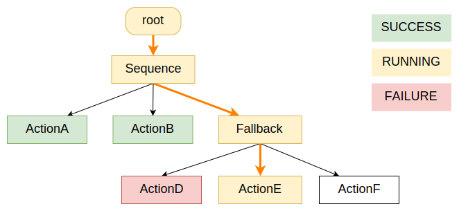

# Understand Asynchrous Nodes, Concurrency and Parallelism

When designing reactive Behavior Trees, it is important to understand 2 main concepts:

- what we mean by **"Asynchronous"** Actions VS **"Synchronous"** ones.
- The difference between **Concurrency** and **Parallelism** in general and in the context of BT.CPP.

## Concurrency vs Parallelism

If you Google those words, you will read many good articles about this topic.

!!! info "Defintions"
    **Concurrency** is when two or more tasks can start, run, and complete in overlapping time periods. It doesn't necessarily mean they'll ever both be running at the same instant. 

    **Parallelism** is when tasks literally run at the same time in different  threads, e.g., on a multicore processor.

BT.CPP executes all the nodes **Concurrently**, in other words:

- The Tree execution engine itself is single-threaded.
- all the `tick()` methods are **always** executed sequentially.
- if any `tick()` method is blocking, the entire execution is blocked.

We achieve reactive behaviors through "concurrency" and asynchronous execution.

In other words, an Action that takes a long time to execute should, instead,
return as soon as possible the state RUNNING to notify that the action was started,
and only when ticked again check if the action is completed or not.

An Asynchronous node may delegate this long execution either to another process,
another server or simply another thread.

## Asynchronous vs Synchronous

In general, an Asynchronous Action (or TreeNode) is simply one that:

- May return RUNNING instead of SUCCESS or FAILURE, when ticked.
- Can be stopped as fast as possible when the method `halt()` (to be implemented by the developer) is invoked.

When your Tree ends up executing an Asynchronous action that returns running, that RUNNING state is usually propagated backbard and the entire Tree is itself in the RUNNING state.

In the example below, "ActionE" is asynchronous and RUNNING; when
a node is RUNNING, usually its parent returns RUNNING too.



Let's consider a simple "SleepNode". A good template to get started is the StatefulAction

```c++
// Example of Asynchronous node that use StatefulActionNode as base class
class SleepNode : public BT::StatefulActionNode
{
  public:
    SleepNode(const std::string& name, const BT::NodeConfiguration& config)
      : BT::StatefulActionNode(name, config)
    {}

    static BT::PortsList providedPorts()
    {
      // amount of milliseconds that we want to sleep
      return{ BT::InputPort<int>("msec") };
    }

    NodeStatus onStart() override
    {
      int msec = 0;
      getInput("msec", msec);

      if( msec <= 0 ) {
        // No need to go into the RUNNING state
        return NodeStatus::SUCCESS;
      }
      else {
        using namespace std::chrono;
        // once the deadline is reached, we will return SUCCESS.
        deadline_ = system_clock::now() + milliseconds(msec);
        return NodeStatus::RUNNING;
      }
    }

    /// method invoked by an action in the RUNNING state.
    NodeStatus onRunning() override
    {
      if ( std::chrono::system_clock::now() >= deadline_ ) {
        return NodeStatus::SUCCESS;
      }
      else {
        return NodeStatus::RUNNING;
      }
    }

    void onHalted() override
    {
      // nothing to do here...
      std::cout << "SleepNode interrupted" << std::endl;
    }

  private:
    std::chrono::system_clock::time_point deadline_;
};
```

In the code above:

1. When the SleepNode is ticked the first time, the `onStart()` method is executed.
This may return SUCCESS immediately if the sleep time is 0 or will return RUNNING otherwise.
2. We should continue ticking the tree in a loop. This will invoke the method
`onRunning()` that may return RUNNING again or, eventually, SUCCESS.
3. Another node might trigger a `halt()` signal. In this case, the `onHalted()` method is invoked. We can take the opportunity to clean up our internal state.

## Avoid blocking the execution of the tree

A **wrong** way to implement the `SleepNode` would be this one:

```c++
// This is the synchronous version of the Node. probably not what we want.
class BadSleepNode : public BT::ActionNodeBase
{
  public:
    BadSleepNode(const std::string& name, const BT::NodeConfiguration& config)
      : BT::ActionNodeBase(name, config)
    {}

    static BT::PortsList providedPorts()
    {
      return{ BT::InputPort<int>("msec") };
    }

    NodeStatus tick() override
    {  
      int msec = 0;
      getInput("msec", msec);
      // This blocking function will FREEZE the entire tree :(
      std::this_thread::sleep_for( std::chrono::milliseconds(msec) );
      return NodeStatus::SUCCESS;
     }

    void halt() override
    {
      // No one can invoke this method, because I freezed the tree.
      // Even if this method COULD be executed, there is no way I can
      // interrupt std::this_thread::sleep_for()
    }
};
```

## The problem with multi-threading

In the early days of this library (version 1.x), spawning a new thread
looked like a good solution to build asynchronous Actions.

That was a bad idea, for multiple reasons:

- Accessing the blackboard in a thread-safe way is harder (more about this later).
- You probably don't need to.
- People think that this will magically make the Action "asynchronous", but they forget that it is still **their responsibility** to stop that thread "somehow" when the `halt()`method is invoked.

For this reason, users are usually discouraged from using `BT::AsyncActionNode` as a
base class. Let's have a look again at the SleepNode.

```c++
// This will spawn its own thread. But it still has problems when halted
class BadSleepNode : public BT::AsyncActionNode
{
  public:
    BadSleepNode(const std::string& name, const BT::NodeConfiguration& config)
      : BT::ActionNodeBase(name, config)
    {}

    static BT::PortsList providedPorts()
    {
      return{ BT::InputPort<int>("msec") };
    }

    NodeStatus tick() override
    {  
      // This code runs in its own thread, therefore the Tree is still running.
      // This seems good but the thread still can't be aborted
      int msec = 0;
      getInput("msec", msec);
      std::this_thread::sleep_for( std::chrono::milliseconds(msec) );
      return NodeStatus::SUCCESS;
    }

    // The halt() method can not kill the spawned thread :(

    // Keep in mind that most of the time we should not
    // override AsyncActionNode::halt()
};
```

A correct version would be:

```c++
// I will create my own thread here, for no good reason
class ThreadedSleepNode : public BT::AsyncActionNode
{
  public:
    ThreadedSleepNode(const std::string& name, const BT::NodeConfiguration& config)
      : BT::ActionNodeBase(name, config)
    {}

    static BT::PortsList providedPorts()
    {
      return{ BT::InputPort<int>("msec") };
    }

    NodeStatus tick() override
    {  
      // This code run in its own thread, therefore the Tree is still running.
      int msec = 0;
      getInput("msec", msec);

      using namespace std::chrono;
      const auto deadline = system_clock::now() + milliseconds(msec);

      // periodically check isHaltRequested() 
      // and sleep for a small amount of time only (1 millisecond)
      while( !isHaltRequested() && system_clock::now() < deadline )
      {
        std::this_thread::sleep_for( std::chrono::milliseconds(1) );
      }
      return NodeStatus::SUCCESS;
    }

    // The halt() method will set isHaltRequested() to true 
    // and stop the while loop in the spawned thread.
};
```

As you can see, this looks more complicated than the version we implemented
first, using `BT::StatefulActionNode`.
This pattern can still be useful in some case, but you must remember that introducing multi-threading make things more complicated and **should be avoided by default**. 

## Advanced example: client / server communication

Frequently, people using BT.CPP execute the actual task in a different process.

A typical (and recommended) way to do this in ROS is using [ActionLib](http://wiki.ros.org/actionlib).

ActionLib provides exactly the kind of API that we need to implement correctly an asynchronous behavior:

1. A non-blocking function to start the Action.
2. A way to monitor the current state of execution of the Action.
3. A way to retrieve the result or the error messages.
4. The ability to preempt / abort an action that is being executed.

None of these operations are "blocking", therefore we don't need to spawn our own thread.

More generally, let's assume that the developer has their own inter-processing communication, with a client/server relationship between the BT executor and the actual service provider.

The corresponding **pseudo-code** implementation will look like this:

```c++
// This action talk to a remote server
class ActionClientNode : public BT::StatefulActionNode
{
  public:
    SleepNode(const std::string& name, const BT::NodeConfiguration& config)
      : BT::StatefulActionNode(name, config)
    {}

    NodeStatus onStart() override
    {
      // send a request to the server
      bool accepted = sendStartRequestToServer();
      // check if the request was rejected by the server
      if( !accepted ) {
        return NodeStatus::FAILURE;
      }
      else {
        return NodeStatus::RUNNING;
      }
    }

    /// method invoked by an action in the RUNNING state.
    NodeStatus onRunning() override
    {
      // more psuedo-code
      auto current_state = getCurrentStateFromServer();

      if( current_state == DONE )
      {
        // retrieve the result
        auto result = getResult();
        // check if this result is "good"
        if( IsValidResult(result) ) {
          return NodeStatus::SUCCESS;
        } 
        else {
          return NodeStatus::FAILURE;
        }
      }
      else if( current_state == ABORTED ) {
        // fail if the action was aborted by some other client
        // or by the server itself
        return NodeStatus::FAILURE;
      }
      else {
        // probably (current_state == EXECUTING) ?
        return NodeStatus::RUNNING;
      }
    }

    void onHalted() override
    {
      // notify the server that the operation have been aborted
      sendAbortSignalToServer();
    }
};
```
