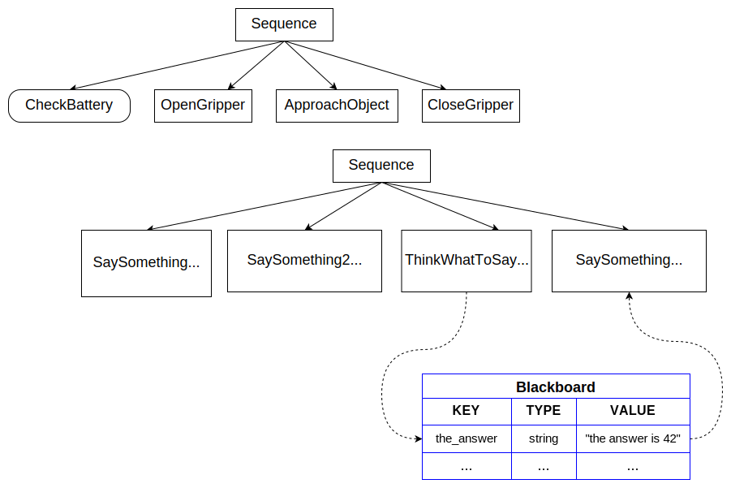

# Input and Output Ports

As we explained earlier, custom TreeNodes can be used to execute an arbitrarily
simple or complex piece of software. Their goal is to provide an interface
with a __higher level of abstraction__.

For this reason, they are not conceptually different from __functions__.

Similar to functions, we often want to:

 - pass arguments/parameters to a Node (__inputs__)
 - get some kind of information out from a Node (__outputs__).
 - The outputs of a node can be the inputs of another node. 

BehaviorTree.CPP provides a basic mechanism of __dataflow__
through __ports__, that is simple to use but also flexible and type safe.

In this tutorial we will create the following tree:



You may notice already as the 2nd child of the Sequence will write on a row
of a Key/Value table (the __Blackboard__) and the 4th node read
from the same row.

## Inputs ports

A valid Input can be either:

- a static string which can be parsed by the Node, or
- a "pointer" to an entry of the Blackboard, identified by a __key__.

A "blackboard" is a simple __key/value storage__ shared by all the nodes
of the Tree.

An "entry" of the Blackboard is a __key/value pair__.

Input ports can read an entry in the Blackboard, whilst an Output port
can write into an entry.

Let's suppose that we want to create an ActionNode called `SaySomething`, 
that should print a given string on `std::cout`.

Such a string will be passed using an input port called `message`.

Consider these alternative XML syntaxes:

```XML
    <SaySomething message="hello world" />
    <SaySomething message="{greetings}" />
```

The attribute `message` in the __first node__ means: 

    "The static string 'hello world' is passed to the port 'message' of 'SaySomething'".

The message is read from the XML file, therefore it can not change at run-time.

The syntax of the __second node__ instead means: 
    
    "Read the current value in the entry of the blackboard called 'greetings' ".

The value of the entry can (and probably will) change at run-time.

The ActionNode `SaySomething` can be implemented as follows:

```C++
// SyncActionNode (synchronous action) with an input port.
class SaySomething : public SyncActionNode
{
  public:
    // If your Node has ports, you must use this constructor signature 
    SaySomething(const std::string& name, const NodeConfiguration& config)
      : SyncActionNode(name, config)
    { }

    // It is mandatory to define this static method.
    static PortsList providedPorts()
    {
        // This action has a single input port called "message"
        // Any port must have a name. The type is optional.
        return { InputPort<std::string>("message") };
    }

    // As usual, you must override the virtual function tick()
    NodeStatus tick() override
    {
        Optional<std::string> msg = getInput<std::string>("message");
        // Check if optional is valid. If not, throw its error
        if (!msg)
        {
            throw BT::RuntimeError("missing required input [message]: ", 
                                   msg.error() );
        }

        // use the method value() to extract the valid message.
        std::cout << "Robot says: " << msg.value() << std::endl;
        return NodeStatus::SUCCESS;
    }
};

```

Alternatively the same functionality can be implemented in a simple function. This function takes an instance of `BT:TreeNode` as input in order to access the "message" Input Port:

```c++
// Simple function that return a NodeStatus
BT::NodeStatus SaySomethingSimple(BT::TreeNode& self)
{
  Optional<std::string> msg = self.getInput<std::string>("message");
  // Check if optional is valid. If not, throw its error
  if (!msg)
  {
    throw BT::RuntimeError("missing required input [message]: ", msg.error());
  }

  // use the method value() to extract the valid message.
  std::cout << "Robot says: " << msg.value() << std::endl;
  return NodeStatus::SUCCESS;
}
```


When a custom TreeNode has input and/or output ports, these ports must be 
declared in the __static__ method:

```C++
    static MyCustomNode::PortsList providedPorts();
```

The input from the port `message` can be read using the template method 
`TreeNode::getInput<T>(key)`.

This method may fail for multiple reasons. It is up to the user to
check the validity of the returned value and to decide what to do:

- Return `NodeStatus::FAILURE`?
- Throw an exception?
- Use a different default value?

!!! Warning "Important"
     It is __always__ recommended to call the method `getInput()` inside the 
     `tick()`, and __not__ in the constructor of the class.
     
     The C++ code __must not make any assumption__ about 
     the nature of the input, which could be either static or dynamic.
     A dynamic input can change at run-time, for this reason it should be read 
     periodically. 

## Output ports

An input port pointing to the entry of the blackboard will be valid only
if another node have already written "something" inside that same entry.

`ThinkWhatToSay` is an example of Node that uses an __output port__ to write a 
string into an entry.

```C++
class ThinkWhatToSay : public SyncActionNode
{
  public:
    ThinkWhatToSay(const std::string& name, const NodeConfiguration& config)
      : SyncActionNode(name, config)
    {
    }

    static PortsList providedPorts()
    {
        return { OutputPort<std::string>("text") };
    }

    // This Action writes a value into the port "text"
    NodeStatus tick() override
    {
        // the output may change at each tick(). Here we keep it simple.
        setOutput("text", "The answer is 42" );
        return NodeStatus::SUCCESS;
    }
};
```

Alternatively, most of the time for debugging purposes, it is possible to write a
static value into an entry using the built-in Actions called `SetBlackboard`.

```XML
 <SetBlackboard   output_key="the_answer" value="The answer is 42" />
```

## A complete example

In this example, a Sequence of 4 Actions is executed:

- Actions 1 and 2 read the input `message` from a static string (`SaySomething2` is a SimpleActionNode).

- Action 3 writes something into the entry of the blackboard called `the_answer`.

- Action 4 read the input `message` from an entry in the blackboard called `the_answer`.

```XML
<root main_tree_to_execute = "MainTree" >
    <BehaviorTree ID="MainTree">
       <Sequence name="root_sequence">
           <SaySomething     message="hello" />
           <SaySomething2    message="this works too" />
           <ThinkWhatToSay   text="{the_answer}"/>
           <SaySomething     message="{the_answer}" />
       </Sequence>
    </BehaviorTree>
</root>
```

The C++ code:

```C++
#include "behaviortree_cpp_v3/bt_factory.h"

// file that contains the custom nodes definitions
#include "dummy_nodes.h"

int main()
{
    using namespace DummyNodes;
    
    BehaviorTreeFactory factory;

    factory.registerNodeType<SaySomething>("SaySomething");
    factory.registerNodeType<ThinkWhatToSay>("ThinkWhatToSay");

    // SimpleActionNodes can not define their own method providedPorts().
    // We should pass a PortsList explicitly if we want the Action to 
    // be able to use getInput() or setOutput();
    PortsList say_something_ports = { InputPort<std::string>("message") };
    factory.registerSimpleAction("SaySomething2", SaySomethingSimple, 
                                 say_something_ports );

    auto tree = factory.createTreeFromFile("./my_tree.xml");

    tree.tickRoot();

    /*  Expected output:

        Robot says: hello
        Robot says: this works too
        Robot says: The answer is 42
    */
    return 0;
}
```

We "connect" output ports to input ports using the same key (`the_answer`);
this means that they "point" to the same entry of the blackboard.

These ports can be connected to each other because their type is the same,
i.e. `std::string`.


